# Meet manganese auride

.grid[
.pull-left-60.flex[
.valign[
- Single crystal structure is tetragonal and layered

- A metal that is a permanent magnet at room temperature

- Magnetic order forms a corkscrew-like spiral structure

- The spiral angle can be controlled in several ways
]
]
	
.pull-right-40.flex[
.valign[
```{r mnau2-crystal-structure, echo = FALSE, out.width = "90%", fig.align=NA}
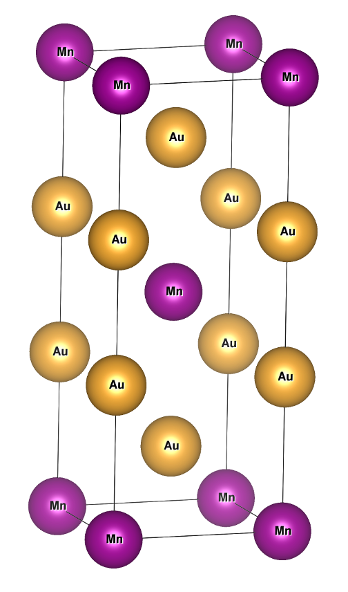
```
]
.valign[
```{r mnau2-magnetic-structure, echo = FALSE, out.width = "75%", fig.align=NA}
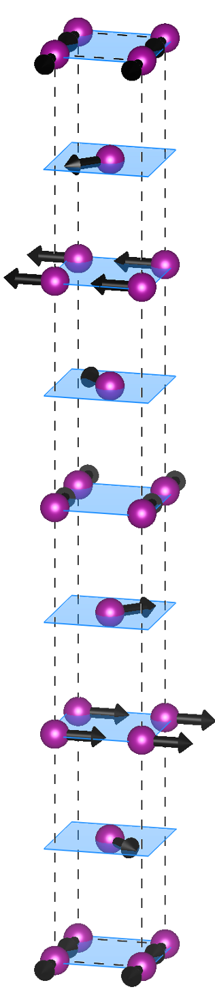
```
]
]
]

---

# Meet manganese auride

.grid[
.pull-left-60.flex[
.valign[
- **Temperature:** magnetic order disappears above 363 degrees Kelvin (194 $^{\circ}$F)

- **Magnetic fields:** spiral unravels to ferromagnetic order at 10 kilo-oersted (MRI device)

- **Pressure:** spiral unravels to ferromagnetic order at 10 kilobars of pressure (10 times the pressure at the bottom of the Mariana Trench)

.content-box-gray[
- **Potential logic device:** changing the spiral angle also changes the material's electrical resistance
]
]
]
	
.pull-right-40.flex[
.valign[
```{r mnau2-crystal-structure, echo = FALSE, out.width = "90%", fig.align=NA}
```
]
.valign[
```{r mnau2-magnetic-structure, echo = FALSE, out.width = "75%", fig.align=NA}
```
]
]
]

---

# How to study this?

.grid[
.grid-valign[
.content-box-red[
**Derive a mathematical model**
]
.content-box-green[
**Gather/generate data**
]
.content-box-yellow[
**Model training**
]
]
]

---

# Derive a mathematical model

.grid[
.content-box-red.grid-valign[
**Derive a mathematical model**

- Energy-based model for magnetic interactions

- Physically meaningful model parameters
]
]

---

# Classical Heisenberg Model

.pull-left[
```{r heisenberg-model-afm-checkerboard, echo = FALSE, out.width = "85%"}
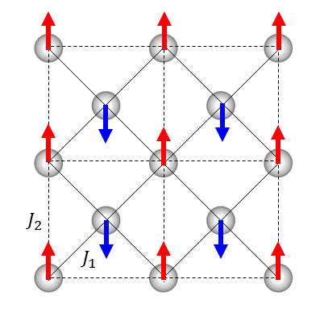
```
]

.pull-right[
<div style="margin-bottom: 10%;"></div>
.content-box-gray.center[Model quantifies the _nature_ and _strength_ of magnetic interactions]

$$H=\dfrac{1}{2}\sum_{ij}J_{ij}\hat{m}_{i}\cdot\hat{m}_{j}$$

- _J_ > 0: parallel alignment preferred

- _J_ < 0: anti-parallel alignment preferred
]

```{r github-neighbormodels, echo = FALSE, out.width = "75%"}

```

---

# 1D magnetic spiral model

```{r heisenberg-1d-spiral, echo = FALSE, out.width = "80%"}
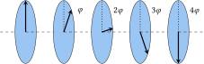
```

- The magnetic vectors for manganese auride all sit in-plane and the planes are parallel (known from experiment)

- The relative angle between any two neighboring magnetic vectors is always $\varphi$, the relative angle between second-nearest neighbors is $2\varphi$, and so on

- Heisenberg model reduces to the following simplified form,

  $$E(\varphi)=\dfrac{1}{2}\sum_{n}J_{n}\cos\left(n\varphi\right)$$

---

# Gather/generate data

.grid[
.content-box-green.grid-valign[
**Gather/generate data**

- First-principles electronic structure calculations based on quantum mechanics (density functional theory)

- Serves as a virtual laboratory for investigating a material's electrical, magnetic, structural, and transport properties

- Calculate realistic and accurate energies for different magnetic patterns at different pressures
]
]

---

# Electronic structure overview

```{r two-atoms-unbonded, echo = FALSE, out.width = "100%"}

```

.center[Energy spectra of 2 simple atoms, no bonding]

---

# Electronic structure overview

```{r two-atoms-bonded, echo = FALSE, out.width = "100%"}

```

.center[Energy spectra of 2 bonded atoms]

---

# Electronic structure overview

```{r four-atoms-bonded, echo = FALSE, out.width = "100%"}

```

.center[Energy spectra of 4 bonded atoms]

---

# Electronic structure overview

```{r eight-atoms-bonded, echo = FALSE, out.width = "100%"}

```

.center[Energy spectra of 8 bonded atoms]

---

# Electronic structure overview

```{r many-atoms-bonded, echo = FALSE, out.width = "100%"}

```

.center[Energy spectra of many bonded atoms]

---

# Electronic structure overview

.pull-left[
* Electrons fill the energy bands much like water fills a drinking glass

* The _Fermi energy_ is where the energy filling process maxes out

* Many important materials properties depend on the location of the Fermi energy
]

.pull-right[
```{r band-schematic, echo = FALSE, out.width = "100%"}

```
]

.content-box-gray[
- **Metal:** The Fermi energy lies within an energy band
- **Insulator/semiconductor:** The Fermi energy sits at the top of an energy band
]

.content-box-green.center[The topology of the _band structure_ depends on a material's structural and chemical details.]

---

# .font80[First-principles structural relaxation]

- **Optimization problem:** constrain the volume of our material, then move the atoms around until the energy is minimized

- **Data output:** energy as a function of volume

- **Birch-Murnaghan equation of state model:** mapping between volume and pressure

```{r mnau2-eos, echo = FALSE, out.width = "75%"}
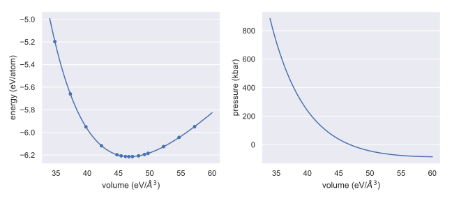
```

---

# .font80[First-principles magnetic energies]

### Workflow

1. **Vary parameters:** pressure, adding/subtracting charge

2. **Calculate energies:** standard set of spiral angles

3. **Data preprocessing:** extract and clean data from output files and save to disk

<div style="margin-bottom: 10%;"></div>

.content-box-gray[
- 1,572 calculations to run on a high-performance computing cluster

- 64 to 128 cores and 1–2 hours runtime per calculation
]

---

# .font80[First-principles magnetic energies]

```{r mnau2-spiral-energies, echo = FALSE, out.width = "100%"}
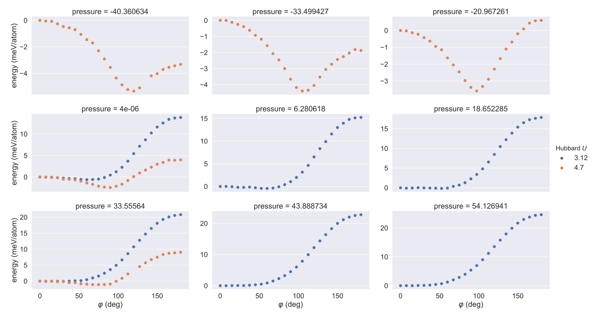
```

---

# Model training

.grid[
.content-box-yellow.grid-valign[
**Model training**

- Train model using regression techniques

- Cross-validation

- Model/feature selection
]
]

---

# Model training methods

```{r scikit-learn-frontpage, echo = FALSE, out.width = "90%"}

```

- **Model features:** derived from 1D Heisenberg model, consider cutoffs of up to 5 neighbors

- **Regression:** ordinary least squares (ridge regression also checked)

- **Cross-validation technique:** repeated k-fold (10 folds, 20 repeats), score using mean-squared error

- **Model selection approach:** select the neighbor cutoff where improvements in mean-squared error become marginal

---

# Cross-validation results

```{r mnau2-heisenberg-1d-crossval-mse, echo = FALSE, out.width = "80%"}
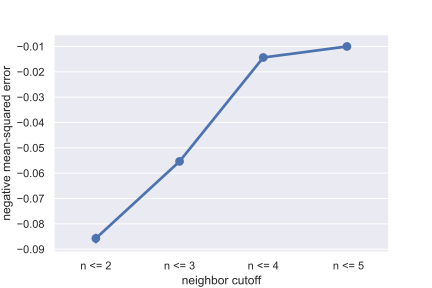
```

---

# Selected model performance

```{r mnau2-heisenberg-1d-obsv-vs-pred, echo = FALSE, out.width = "80%"}
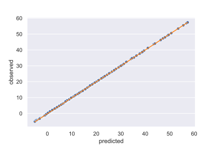
```

---

# .font80[Fitted parameters vs pressure]

```{r mnau2-exchange-vs-pressure, echo = FALSE, out.width = "80%"}
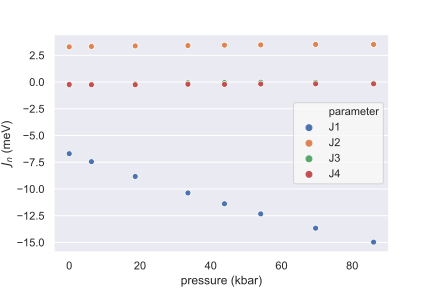
```

---

# .font80[Spiral angle vs pressure]

```{r mnau2-angle-vs-pressure, echo = FALSE, out.width = "80%"}
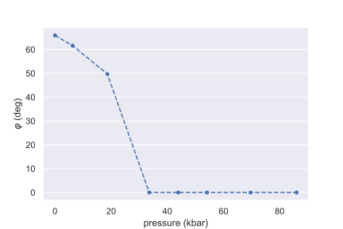
```

---

# .font60[Build spiral model using _collinear_ calculations]

.content-box-red.center[
**Recent and ongoing work**
]

<div style="margin-bottom: 7%;"></div>

- Noncollinear magnetic order is typically **not** well-behaved like manganese auride

- First-principles computational discovery of noncollinear magnetic order is difficult

- Computing and analyzing the magnetic energy landscape from a trained model is far easier

- Train Heisenberg model on magnetic energies for collinear magnetic patterns, then use it to detect noncollinear order

- Use manganese auride to prototype this idea

---

# Preliminary results

```{r mnau2-col-only-obsv-vs-pred, echo = FALSE, out.width = "60%"}
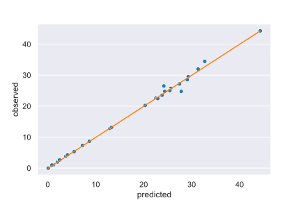
```

| method       | J<sub>1</sub> | J<sub>2</sub> | J<sub>3</sub> | J<sub>4</sub> | $\varphi$ |
| ------       | -------       | -------       | -------       | -------       | -------   |
| collinear    | -6.419532     | 2.911147      | -0.174256     | -0.259623     | 63.5      |
| noncollinear | -6.703701     | 3.287076      | -0.31799      | -0.235331     | 65.9      |

---

# Where to go from here

.grid[
.pull-up[
.content-box-green[
**What's done**

- Numerical study of the phase diagram of 1D spiral model
- Is the pressure-induced unraveling of the spiral angle to ferromagnetic order continuous or discontinous?
]
]

.pull-lower-left[
```{r mnau2-phase-transition-diagram, echo = FALSE, out.width="56%"}
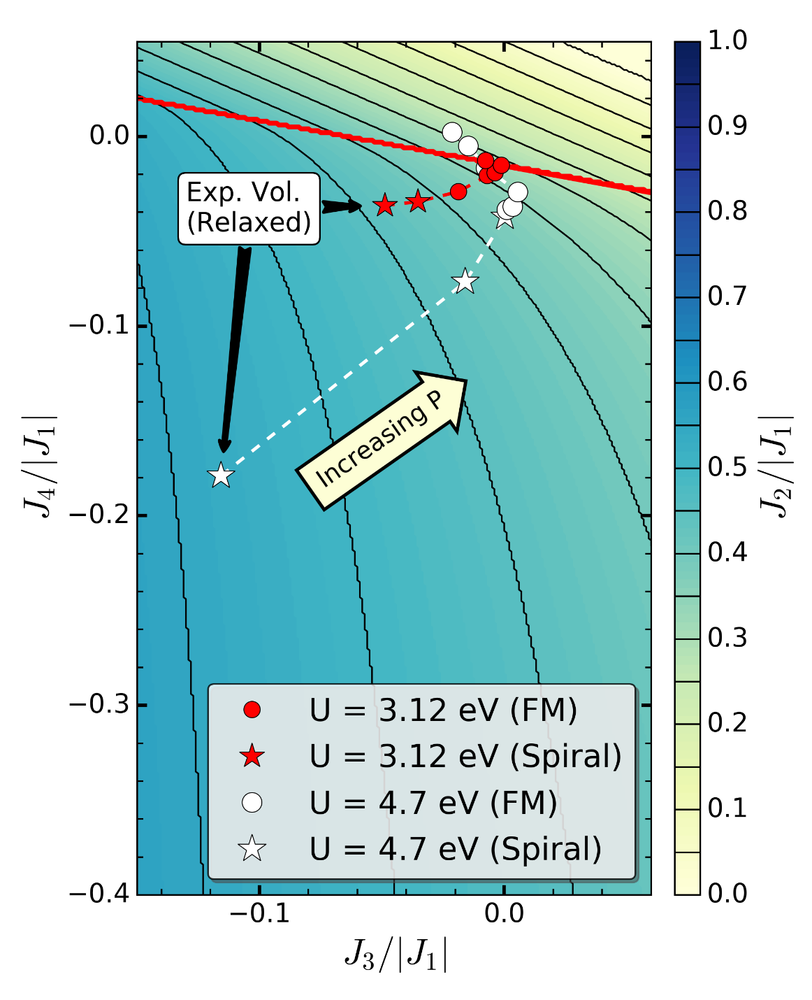
```
]

.pull-lower-right[
```{r mnau2-phase-diagram, echo = FALSE, out.width="65%"}
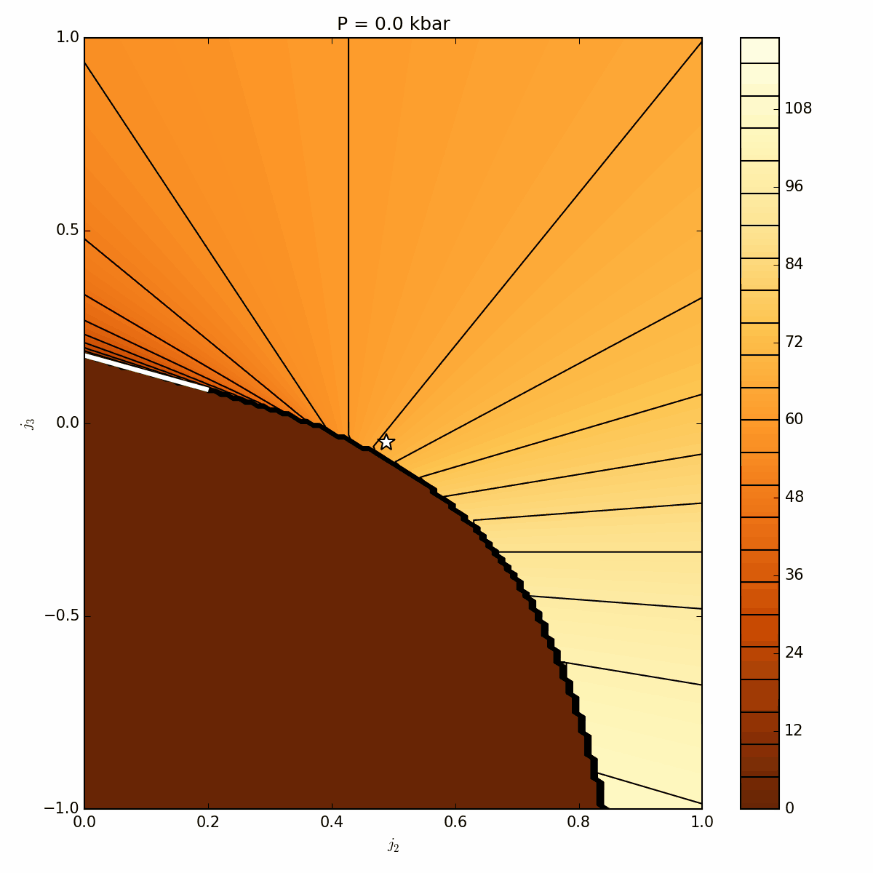
```
]
]

---

# Where to go from here

.grid[
.pull-up[
.content-box-yellow[
**Ongoing work**

- Extend model parameters to explicitly depend on pressure
- Numerical finite temperature studies using Markov-Chain Monte Carlo simulations
- Automating the computational discovery of noncollinear magnetic order
]
]

.pull-down[
```{r github-spyns, echo = FALSE, out.width = "100%"}
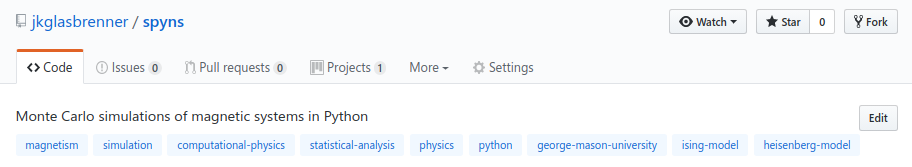
```
]
]

---

class: clear, center, middle

# .black[Questions?]

<div style='float:left'></div><hr color='#EB811B' size=1px width=796px>
